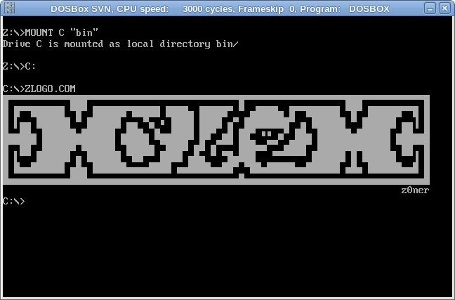

# ZPACK

ZPACK is a post-linker binary compression tool for sizecoding and retro programming enthusists. When compressing tiny demoscene programs, there is a trade-off between decoder size (in bytes) and how well an algorithm compresses *your* program. With 512-byte, 1024-byte and even 4-kilobyte intros, reducing the size of the loader stub can be just as important as tweeking a binary for compressibility.

ZPACK offers a good balance providing an optimal dynamic-programming encoder for the [ZX2](https://github.com/einar-saukas/ZX2) format and a 53-byte, fast decompression stub for MS-DOS using only 8086 instructions. Testing has shown this approach compares favorabily with other LZSS "run-length" based stategies, providing dozens of bytes of savings even with assembly instructions hand optimized for other binary compression tools.

# Usage

Binary compressors work by unpacking a program into memory and then transfering execution. Early DOS compressors such as [EXEPACK](https://www.bamsoftware.com/software/exepack/), [PKLITE](http://justsolve.archiveteam.org/wiki/PKLITE) and the more modern [UPX](https://upx.github.io/) work on existing binaries *as-is*. That is, after unpacking, the decompressed program is copied and executes exactly as-if it were loaded by the host OS, completely unmodified.

To avoid this copy (and extra loader instructions) ZPACK requires input DOS COM programs be compiled and linked to execute from the address where they are unpacked. This location (program origin) can be provided directly on the command line:

```
$ zpack --help
Usage: bin/zpack [options] <binary>

Options:

  -o --output <program>           Output file name for packed program
  -O --origin <address>           Program base address (default 0x1100)
  -c --check                      Compress stdin and print statistics
  -p --payload                    Write out just the payload
  -D --decode                     Assume packed input and decompress
  -h --help                       Display this help and exit
```

Assuming a 1024-byte (after compression) DOS COM program has been compiled to run from `org 0x500`, it can be compressed with:

`zpack -O 0x500 -o zintro.com intro.com`

# Example

The [logo.asm](src/logo.asm) listing is a simple DOS COM program that prints out a logo:

```asm
%ifndef ORIGIN
  ORIGIN equ 0x100
%endif

  org ORIGIN
start:
  mov dx, logo
  mov ah, 9
  int 0x21
  ret

logo:
db "ÛßßßßßßßßßßßÛÛÛßßßßßßßßßßßßßßßßßßßßßßßßßßßÛßßßßßßßßßßßßßßßßßßÛÛÛßßßßßßßßßßßÛ", 13, 10
db "Û ÛßßÛÛÛÛÛÛ ßÛß ÛÛÛÛÛÛßÛÛÛÛÛ ÛÛÛÛÜ ÛÛÛÛÛß ß ÜÛÛÛÛÜ ÛßßÛÛÛÛÛÛ ßÛß ÛÛÛÛÛÛßßÛ Û", 13, 10
db "Û ÝÜÜ ÛÛÛÛÛÛ ß ÛÛÛÛÛÛ ÜÜ ßÜ þ ÛÛÛÛ ÛÛÛÛ Üß ÛÛÛÛÛÛÛÛß Ü ÛÛÛÛÛÛ ß ÛÛÛÛÛÛ ÜÜÞ Û", 13, 10
db "ÛÜÜÛÛÜ ÛÛÛÛÛÛÜÛÛÛÛÛÛ ÜÛÛÛÜ ÛÜÜÛÛÛÛ ÛÛß ÜÛ ÛÛß þþ Üß ÛÛÜ ÛÛÛÛÛÛÜÛÛÛÛÛÛ ÜÛÛÜÜÛ", 13, 10
db "ÛßßÛÛß ÛÛÛÛÛÛßÛÛÛÛÛÛ ßÛÛÛÛÜ ßÛÛÛÛ ÜÛ Üßßß ÛÛÛÜÜßß ÜÛÛÛß ÛÛÛÛÛÛÛÛÛÛÛÛÛ ßÛÛßßÛ", 13, 10
db "Û Ýßß ÛÛÛÛÛÛ Ü ÛÛÛÛÛÛ ßÛÛßß ÛÛÛÛ ÜÛÜ ß ßÛÜÛÛÛ   ßßßßßß ÛÛÛÛÛÛ Û ÛÛÛÛÛÛ ßßÞ Û", 13, 10
db "Û ÛÜÜÛÛÛÛÛÛ ÜÛÜ ÛÛÛÛÛÛÜÜÜÜÛÛÛÛ ÜÜÛÛÛÛÜÜÛÛß ßÛÛÜÛÛÛÛÛÜÜÛÛÛÛÛÛ ÜÛÜ ÛÛÛÛÛÛÜÜÛ Û", 13, 10
db "ÛÜÜÜÜÜÜÜÜÜÜÜÛÛÛÜÜÜÜÜÜÜÜÜÜÜÜÜÜÜÜÜÜÜÜÜÜÜÜÜÜÜÛÜÜÜÜÜÜÜÜÜÜÜÜÜÜÜÜÜÜÜÜÜÜÜÜÜÜÜÜÜÜÜÜÛ", 13, 10
db "                                                                       z0ner", '$'
```

It can be built and run with:

```
$ make run
nasm -o bin/logo.com src/logo.asm
dosbox bin/logo.com
```


To rebuild with a different origin, compress with ZPACK, and run:

```
$ make run zlogo
nasm -DORIGIN=0x500 -o bin/zlogo.com src/logo.asm
bin/zpack -o bin/zlogo.com -O 0x500 bin/zlogo.com
Encoded size: 1604 bits
Packed ratio: 201/709 (28.35%)
Decoder size: 53 bytes
Binary ratio: 254/709 (35.83%)
dosbox bin/zlogo.com
```



The compressed binary is ~1/3 the size of the original:

```
$ stat -c "%s %n" -- bin/*logo.com
709 bin/logo.com
254 bin/zlogo.com
```

You can recover the original input using the `-D --decode` paramter:

```
$ bin/zpack -D -o logo.com bin/zlogo.com
Program org: 0x500
Encoded size: 1604 bits
Packed ratio: 201/709 (28.35%)
Decoded size: 709 (bytes)
Binary ratio: 254/709 (35.83%)
```

# Acknowledgments

I would like to thank HellMood, pestis, superogue, neon, Dresdenboy and my other sizecoding friends for their help with the 8086 decoder stub and especially Milos "mbaze" Bazelides who provided extremely useful insights into writing an optimal encoder for ZX2.

This project builds on significant compression research from the z80 retro community and I am grateful to Einar Saukas for making the ZX0, ZX1 and ZX2 tools open source.

And of course, Nic "zoner" Soudée for the awesome logo from our second xylem release 30 years ago.

unlord / xylem

2026-Jan-10
